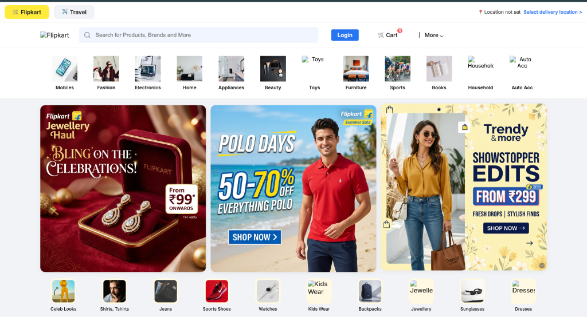
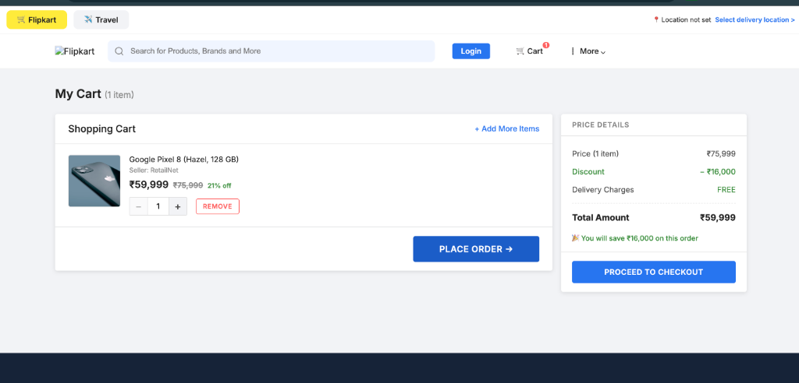
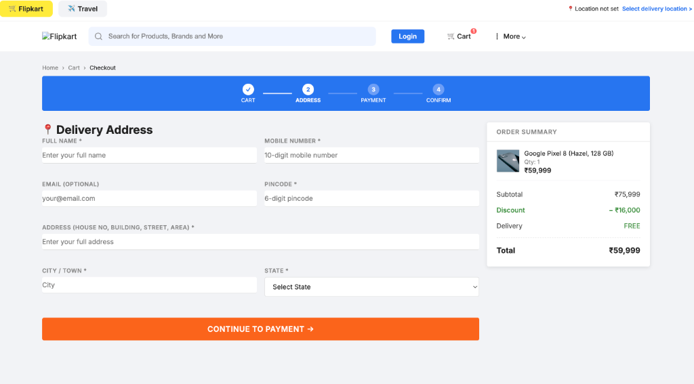
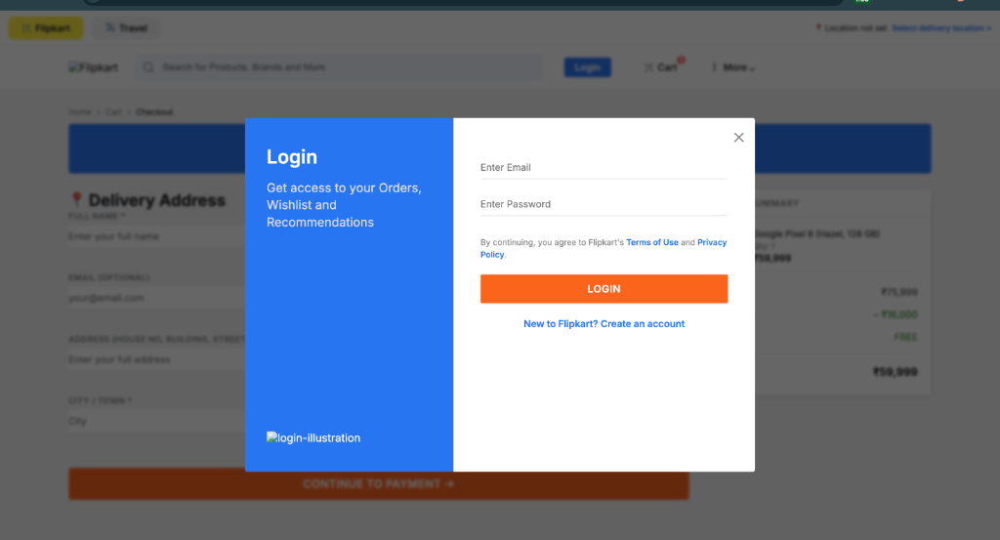

# Flipkart Clone — Fullstack E-Commerce Platform

A high-fidelity, fully functional Flipkart-clone built as an SDE Intern Fullstack Assignment.

## 📱 App Preview

| Home Page | Shopping Cart |
|:---:|:---:|
|  |  |

| Checkout Process | Login Modal |
|:---:|:---:|
|  |  |

## 🛠 Tech Stack

| Layer | Technology |
|---|---|
| Frontend | **Next.js 14** (App Router, React 18) |
| Backend | **Node.js + Express.js** |
| Database | **SQLite** (via `better-sqlite3`) |
| Styling | **Vanilla CSS** (Flipkart Design Language) |

## ✨ Features

- ✅ **High-Fidelity UI** — Pixel-perfect replica of Flipkart header, category bar, and banners.
- ✅ **Dynamic Catalog** — 110+ products across 12 categories with reliable CDN imagery.
- ✅ **Seamless Cart** — LocalStorage-based cart for instant responsiveness and persistence.
- ✅ **Checkout Flow** — Full delivery form validation and order summary.
- ✅ **Authentication** — Modern login/signup modals.

## 📁 Project Structure

```
flipkart-clone/
├── backend/
│   ├── server.js          # Express entry point (port 5001)
│   ├── db.js              # SQLite schema
│   └── seed.js            # Comprehensive product catalog seeder
├── frontend/
│   ├── app/               # Next.js App Router (Cart, Orders, Auth)
│   ├── components/        # Reusable UI (ProductCard, Navbar, etc.)
│   ├── public/icons/      # Custom PNG category icons
│   └── lib/api.js         # "Smart API" (Auto-switches Dev/Prod)
└── screenshots/           # App preview images
```

## 🚀 Setup & Running

### 1. Backend
```bash
cd backend
npm install
node server.js
# API running at http://localhost:5001
```

### 2. Frontend
```bash
cd frontend
npm install
npm run dev
# App running at http://localhost:3000
```

## 🚀 Deployment

- **Live URL**: [flipkart-clone-app-puce.vercel.app](https://flipkart-clone-app-puce.vercel.app/)
- **Backend**: Deployed on Railway.
- **Frontend**: Deployed on Vercel.
