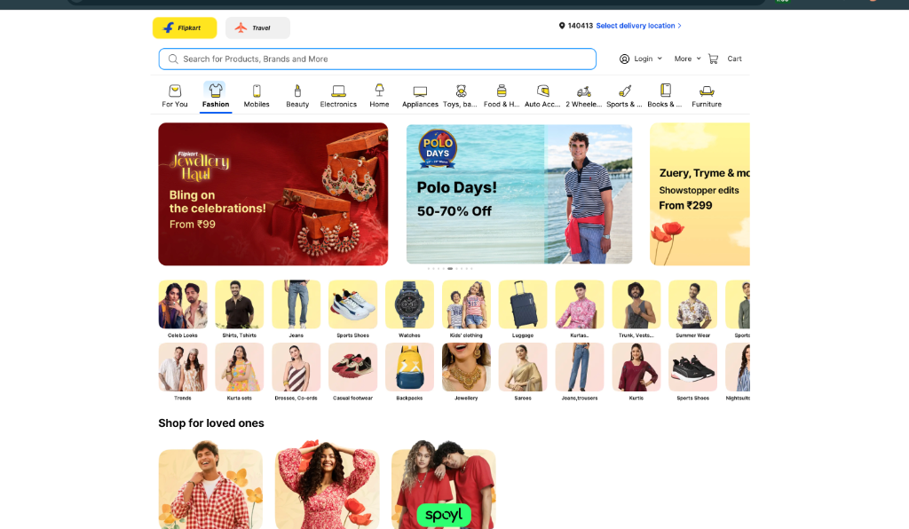

# Flipkart Clone — Fullstack E-Commerce Platform



A fully functional Flipkart-clone e-commerce web application built as an SDE Intern Fullstack Assignment.

## 🛠 Tech Stack

| Layer | Technology |
|---|---|
| Frontend | **Next.js 14** (App Router, React 18) |
| Backend | **Node.js + Express.js** |
| Database | **SQLite** (via `better-sqlite3` — zero setup!) |
| Styling | **Vanilla CSS** (Flipkart design system) |

## ✨ Features

### Core Features (Must Have)
- ✅ **Product Listing Page** — 4-column grid, Flipkart card design, search by name, filter by category
- ✅ **Product Detail Page** — Image carousel with thumbnails, specs table, stock status, Add to Cart & Buy Now
- ✅ **Shopping Cart** — Quantity controls (+/−), remove items, price breakdown (subtotal, discount, delivery)
- ✅ **Order Placement** — Checkout with address form + validation, order summary sidebar, order confirmation with ID
- ✅ **Authentication** — Full login/signup functionality with high-fidelity modals

### Bonus Features
- ✅ **Order History** — View all past orders with status, items, and delivery address
- ✅ **75+ Products** — Richly populated catalog across 12 categories
- ✅ **Themed Sections** — Home Decor & Furnishing, Brands in Spotlight, and Premium Spotlight sections
- ✅ **Responsive Design** — Works on mobile (2-col grid), tablet (3-col), and desktop (4-col)
- ✅ **Skeleton Loading** — Shimmer effect while data loads

## 📁 Project Structure

```
flipkart-clone/
├── backend/
│   ├── server.js          # Express entry point (port 5000)
│   ├── db.js              # SQLite schema initialization
│   ├── seed.js            # Auto-seeds 22 products across 6 categories
│   └── routes/
│       ├── products.js    # GET /api/products, GET /api/products/:id
│       ├── cart.js        # GET/POST/PUT/DELETE /api/cart
│       └── orders.js      # GET/POST /api/orders
└── frontend/
    ├── app/
    │   ├── layout.js                    # Root layout + Navbar
    │   ├── page.js                      # Product Listing
    │   ├── product/[id]/page.js         # Product Detail
    │   ├── cart/page.js                 # Shopping Cart
    │   ├── checkout/page.js             # Checkout
    │   ├── order-confirmation/page.js   # Order Confirmation
    │   └── orders/page.js              # Order History
    ├── components/
    │   ├── Navbar.js                    # Sticky navbar with search + cart badge
    │   └── ProductCard.js              # Product card component
    └── lib/
        └── api.js                       # API utility functions
```

## 🗄 Database Schema

```sql
categories    — id, name, icon
products      — id, category_id, name, description, price, original_price,
                discount_percent, rating, review_count, stock, images (JSON), specs (JSON)
cart          — id, product_id, quantity, added_at
orders        — id, order_number, shipping_address (JSON), subtotal, discount,
                delivery_fee, total, status, created_at
order_items   — id, order_id, product_id, product_name, product_image,
                quantity, price_at_purchase
```

**Seed data:** 74 products across 12 categories:
`Mobiles`, `Fashion`, `Electronics`, `Home`, `Appliances`, `Beauty`, `Toys`, `Furniture`, `Sports`, `Books`, `Household`, `Auto Acc`

## 🚀 Setup & Running

### Prerequisites
- Node.js v18+
- npm v9+

### 1. Backend

```bash
cd backend
npm install
node server.js
# API running at http://localhost:5000
```

> The SQLite database (`flipkart.db`) is **auto-created and seeded** on first run — no database setup required!

### 2. Frontend

```bash
cd frontend
npm install
npm run dev
# App running at http://localhost:3000
```

## 🔌 API Endpoints

| Method | Endpoint | Description |
|---|---|---|
| GET | `/api/products` | List products (supports `?search=`, `?category=`) |
| GET | `/api/products/:id` | Single product detail |
| GET | `/api/categories` | List all categories |
| GET | `/api/cart` | Get cart with price summary |
| POST | `/api/cart` | Add item to cart |
| PUT | `/api/cart/:id` | Update item quantity |
| DELETE | `/api/cart/:id` | Remove item from cart |
| POST | `/api/orders` | Place order (clears cart) |
| GET | `/api/orders` | List all orders |
| GET | `/api/orders/:id` | Single order detail |

## 💡 Assumptions

1. **No authentication** — A single default user is assumed (as per assignment spec)
2. **SQLite** chosen for zero-setup developer experience; can be swapped for PostgreSQL/MySQL by changing `db.js`
3. **Product images** are loaded from Unsplash (public CDN) — requires internet connection
4. **Cart persists** in the SQLite database (server-side, not localStorage)
5. **Stock decrements** on order placement and is enforced at checkout

## 🚀 Deployment

The project is configured for **Vercel** (Frontend) and **Railway** (Backend).

### 1. Push Changes to GitHub
```bash
git add .
git commit -m "UI Overhaul: 75+ products, Themed Decor, and Branded Ads"
git push origin main
```

### 2. Manual Redploy (Optional)
Pushing to `main` will trigger automatic builds on Vercel and Railway.

---

## 💡 Key Design Refinements
The app closely replicates the modern Flipkart experience:
- **Blue Navbar** (`#2874f0`) & **Deep Navy Footer** (`#172337`).
- **Horizontal Spotlight** with soft warm gradients.
- **Branded Ads Gallery** for New Balance, Campus, and Reebok.
- **Home Decor Themed Section** with soft purple/blue background.
- **Flipkart Assured** badges and verified green ratings.
